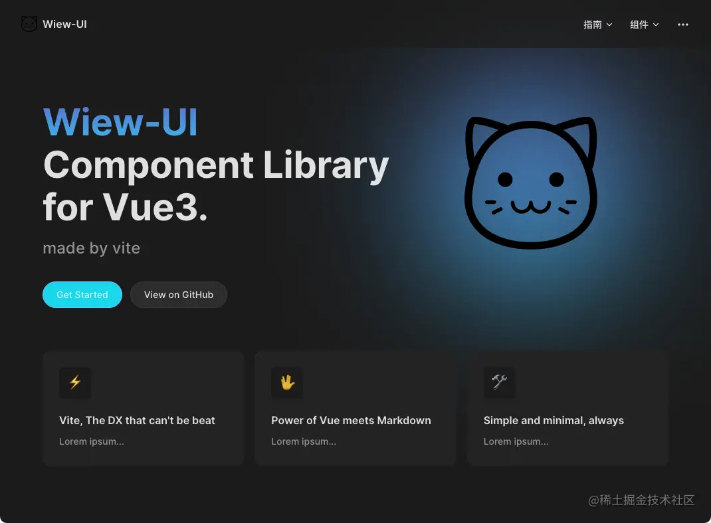

## 工程化的实质

最初的前端程序很简单，只是内嵌于页面上的一段功能能代码。这样的复杂度还没必要使用工程。

随着 Jquery 的出现，前后端分离的时代的到来，前端已经有能力成为 UI 技术的主导力量。后端只需要提供数据接口，其他的交给前端就好。

这样的程序不刷新页面，体验秒杀后端渲染时代的技术。但是随之前端的程序的复杂度就会呈指数形式上升。

这个时候就开始出现了前端技术的萌芽了。我们需要创建独立的前端工程，需要模块化、和组件化提高代码的可读性，需要提供自动化过程来进行代码的 Bundle、压缩、丑化，还需要规范化检查工具控制代码质量。这也就是我们常讲的工程化四化。

- **自动化；**
- **规范化；**
- **模块化；**
- **组件化。**

前端代码经历很多代变化，大概可以分为

- **工作流时代： Grunt 、Gulp 生态；**
- **Bundle 时代： Webpack 生态；**
- **Bundless 时代： Vite 生态。**

工作流时代主要的核心是自动化和优化工作流。相当于给前端任务添加了一套高级的脚本。Bundle 时代是以模块打包机为基础的，通过不同的 Plugin 与 Loader 实现不同功能。这种方式有一个致命问题就是性能。因为一个模块变化必须重新打包，虽然可以用缓存和并行处理提高性能。

随着浏览器对 ES 模块的支持，新的 Bundless 时代到来。Vite 横空出世，Vite 可以利用浏览器对 ES 模块的支持，让前端可以通不打包的方式调试。这样就可以极大提高研发效率。其实更激进的方式是生产环境也使用 ESM，包括第三方库也是通过 ESM 组织。当然这种方式还不太成熟。

新的 Vite 生态中的开发者，都经历了前面两个时代，具有非常丰富的开发经验。所以生态发展很快，文档化、原子 CSS、单元测试都是 Vite 生态的产品。

## 工程化就是来踩坑的

工程化实践可能是所有实践中踩坑最多的。因为一个团队的架构组就是给全组人进行踩坑，他们会尝试不同的路线，尝试不稳定的版本，做 Pre 的性能测试，编写 Pilot Source，应该说他们就是项目的荒野求生之路。

做这种工作的人需要有坚强的意志和奉献的态度。如果你能够做这样的工作，是别人对你的巨大肯定，你也可以通过这个机会来很好地提高你的团队领导力，可以成为团队的开路先锋。

## vitepress 趣玩系列

首页样式优化，自己去玩一下吧 [LINK~](https://juejin.cn/post/7133165263767207966)

优秀作品：

- [WiewUI](https://link.juejin.cn/?target=https%3A%2F%2Fgithub.com%2FgumingWu%2Fwiew-ui)
- [ScottUI](https://link.juejin.cn/?target=https%3A%2F%2Fgithub.com%2Fiscottt%2Fscott-ui)
- [SpUI](https://link.juejin.cn/?target=https%3A%2F%2Fgithub.com%2Flyh0371%2Fsp-ui)
- [BokerUI](https://link.juejin.cn/?target=https%3A%2F%2Fgithub.com%2Fjuetan%2Fbooker-ui)
- [IFun-UI](https://link.juejin.cn/?target=https%3A%2F%2Fgithub.com%2Fngd-b%2Fifun-ui)
- [CatIsol-UI](https://link.juejin.cn/?target=https%3A%2F%2Fgithub.com%2Fisolcat%2FCatIsol-UI)
- [Pup-UI](https://link.juejin.cn/?target=https%3A%2F%2Fgithub.com%2Fyxw007%2FPup-ui)
- [IK-UI](https://link.juejin.cn/?target=https%3A%2F%2Flaine001.github.io%2Fik-ui%2F)
